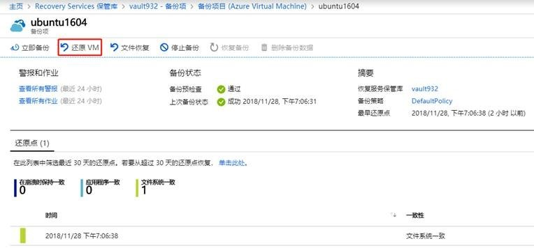
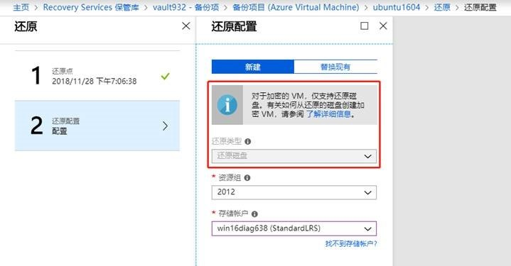
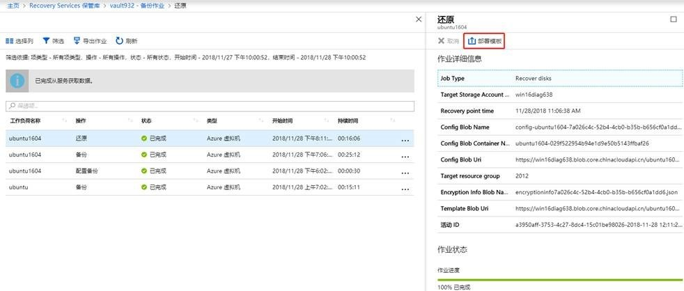
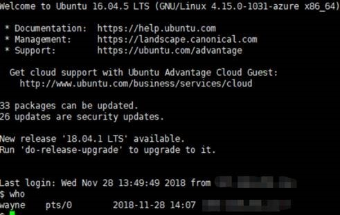

# 有关 Linux 虚拟机的加密和备份还原操作的实施参考

在 Azure 中可以对虚拟机和磁盘进行加密，来提高虚拟机的安全性和合规性。Linux 虚拟机磁盘使用的是 [dm-crypt](https://en.wikipedia.org/wiki/Dm-crypt) 静态加密技术，加密密钥将存储在 Azure 密钥保管库中。

本文以 Ubuntu 16.04 虚拟机为例，提供有关 Linux 虚拟机的加密和备份还原实施参考：

## Linux 虚拟机加密操作

### 准备工作

1. 请确保虚拟机创建来源于镜像市场，且规格的内存大于 7GB，SELinux 功能处于 disabled 状态（如未安装 SELinux 请忽略）详细限制请务必参考此文档：[适用于 Windows 和 Linux IaaS VM 的 Azure 磁盘加密](https://docs.azure.cn/zh-cn/security/azure-security-disk-encryption)。

2. 已在本地安装 Azure CLI 并登录中国区 Azure:

    ```azurecli
    az cloud set -n AzureChinaCloud
    az login
    ```

### 详细步骤

> [!NOTE]
> 以下命令中带 “<>” 的参数为自定义示例参数，请根据实际情况进行替换。

1. 我们需要使用密钥保管库（Key Vault）来存储磁盘加密密钥，密钥保管库需要与待加密虚拟机位于同一区域（location），使用如下命令创建密钥保管库：

    ```azurecli
    az keyvault create --name <mykeyvaultname> --resource-group <LinuxVM> --location <chinanorth> --enabled-for-disk-encryption True
    ```

2. 创建密钥保管库密钥：

    ```azurecli
    az keyvault key create --vault-name <mykeyvaultname> --name <myKey> --protection software
    ```

3. 由于 Azure 磁盘加密将生成加密密钥并将其写入密钥保管库，在密钥保管库中管理加密密钥需要 Azure Active Directory 身份验证。我们可以使用以下命令获取 Azure Active Directory 服务主体 spin-id 和 password，并在后续加密中通过身份验证：

    ```azurecli
    az ad sp create-for-rbac --query [appId,password] -o tsv
    ```

    执行完毕会分别输出 spn-id 和 password，用输出值替换下面命令中的 spin-id 和 password。

4. 设置密钥保管库策略：

    ```azurecli
    az keyvault set-policy --name <mykeyvaultname> --spn spin-id --key-permissions wrapKey --secret-permissions set
    ```

5. 对虚拟机磁盘执行加密操作，需要加密所有磁盘使用参数 `all`，仅加密系统盘使用 `os`，仅加密数据盘使用 `data`：

    ```azurecli
    az vm encryption enable --resource-group <LinuxVM> --name Ubuntu1604 --aad-client-id spin-id --aad-client-secret <password> --disk-encryption-keyvault <mykeyvaultname> --key-encryption-key <myKey> --volume-type <all>
    ```

6. 检查虚拟机加密结果：

    ```azurecli
    az vm encryption show --resource-group <LinuxVM> --name <Ubuntu1604>
    ```

## 备份和还原操作

### 准备工作

1. 使用 Azure CLI 对源虚拟机进行加密。

2. 在 Recovery Service 保管库中对源虚拟机启用备份功能。

### 详细步骤

1. 对于加密虚拟机，目前仅支持还原虚拟机操作，请参考文档[备份和还原 VM 时的限制](https://docs.azure.cn/zh-cn/backup/backup-azure-arm-vms-prepare#limitations-when-backing-up-and-restoring-a-vm)。

    在 Azure 门户 - Recovery Services 保管库 - mykeyvaultname - 备份项 - 备份项目中使用还原虚拟机：

    

2. 进入还原页面，选择还原点，使用新建方式还原磁盘到存储账户中：

    

3. 等待还原作业完成，选择部署模板来新建虚拟机：

    

4. 虚拟机新建完成之后，如果使用基于 cloud-init 的 Linux 分发（如 Ubuntu），出于安全原因，还原后将阻止密码。 需要对还原的虚拟机进行重置密码：

    

5. 使用更新后的用户名/密码登录新建虚拟机，即可访问新建虚拟机：

    